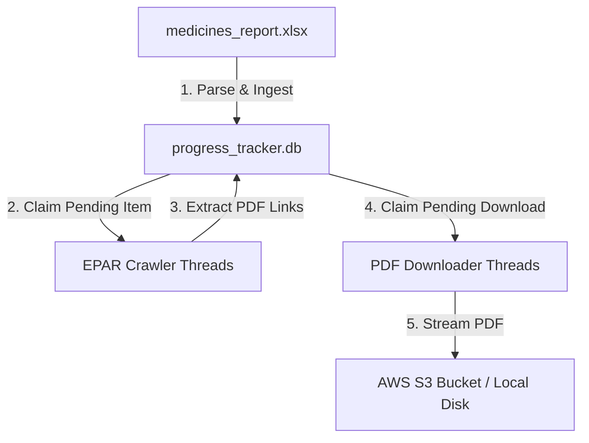

# EMA EPAR Downloader & Centralized Progress Tracker

This directory contains the documentation and execution guidelines for the **European Medicines Agency (EMA) EPAR Downloader** and the shared **Centralized Progress Tracker**.

---

## 1. System Architecture & Core Logic

The system is split into two primary modules:
1. **`progress_tracker.py`**: A shared database tracking utility.
2. **`ema_downloader.py`**: The multi-threaded crawler and S3-streaming downloader.



### Key Logic Features:
* **Dynamic Excel Parsing**: The script downloads and parses the official EMA medicines report. It automatically cleans column headers and maps them dynamically.
* **JSON Metadata Storage**: To handle different columns from different scraping sites (EMA, PMDA, MHRA) in a single database, we use a `metadata_json` column. Site-specific columns are serialized to JSON, allowing a single, unified database (`progress_tracker.db`) to track all scrapers.
* **Direct S3 Streaming**: When configured with S3, downloads bypass the host machine's hard drive entirely. Files are piped directly from the web response stream into AWS S3 using memory buffers.
* **Dual-Tier Checkpoint System**:
  * *Database Check (Tier 1)*: If a file URL is marked as `completed` in the tracking database, the script skips it without any disk or network checks.
  * *Storage Check (Tier 2)*: If the database is reset or out of sync, the script queries S3 (`head_object`) or check local paths before downloading. If the file exists, the script marks it as `completed` in the database and skips it.
* **Referer Header Bypass**: EMA blocks direct PDF hotlinks. The script queries the parent drug EPAR page URL from the database and injects it as the HTTP `Referer` header to bypass these blocks.
* **Atomic Writes (Local Mode)**: Local files are saved as `.tmp` and renamed to `.pdf` only upon a successful 200 response, preventing corrupted files.

---

## 2. CLI Command Line Parameters

You can configure the execution of `ema_downloader.py` using the following parameters:

| Parameter | Type | Default Value | Description |
| :--- | :---: | :---: | :--- |
| `--output-dir` | `str` | `Regulatory & Approvals/ema_data` | Local directory to save downloaded files, reports, and logs. |
| `--threads` | `int` | `5` | Maximum number of concurrent threads to use for both crawling and downloading. |
| `--max-retries` | `int` | `5` | Maximum HTTP request retries using exponential backoff (handles timeouts, HTTP 429, 5xx). |
| `--languages` | `str` | `en` | Comma-separated list of document language codes to download (e.g. `en,fr`), or `all`. |
| `--skip-pdfs` | `flag` | *N/A* | If specified, the script only crawls EPAR pages and saves metadata; no PDF files will be downloaded. |
| `--limit-medicines` | `int` | *None* | Limits the number of medicine EPAR pages to crawl (useful for quick testing). |
| `--limit-downloads` | `int` | *None* | Limits the number of PDFs to download (useful for quick testing). |
| `--reset` | `flag` | *N/A* | Resets the tracking queue for the `ema` source in `progress_tracker.db` to run crawls from scratch. |
| `--download-all-tables`| `flag` | *N/A* | Downloads and exports all 10 additional EMA Excel tables (shortages, orphan designations, referrals, etc.) to CSV. |
| `--refresh-excel` | `flag` | *N/A* | Deletes the old master Excel sheet and downloads a fresh copy from the EMA server to scan for new updates. |
| `--s3-bucket` | `str` | *None* | AWS S3 bucket name. If provided, downloads stream directly to S3 in memory. |
| `--s3-prefix` | `str` | `ema_data` | Folder prefix path on your S3 bucket where all files will be uploaded. |
| `--aws-profile` | `str` | *None* | Named AWS credentials profile to use for S3 authentication (e.g., `moine`). |
| `--force-download` | `flag` | *N/A* | Resets progress checkpoints and bypasses all local/S3 existence checks, overwriting files. |

---

## 3. How to Run (Common Commands)

### A. Incrementally Download new updates to S3 (Recommended)
This command downloads the latest Excel sheet, adds any new medicines to the queue, and streams new PDFs directly to the S3 bucket `moine-data` without downloading them locally:
```powershell
python ema_downloader.py --s3-bucket moine-data --s3-prefix "Regulatory & Approvals/ema_data" --aws-profile moine --threads 10 --refresh-excel
```

### B. Force Download / Redownload All Files to S3
This command resets the tracking database for EMA and forces a complete download, overwriting all existing files in S3:
```powershell
python ema_downloader.py --s3-bucket moine-data --s3-prefix "Regulatory & Approvals/ema_data" --aws-profile moine --threads 10 --force-download
```

### C. Download Metadata Only (No PDFs) to S3
Scrapes all EPAR pages and registers metadata CSV reports on S3 without downloading any PDFs:
```powershell
python ema_downloader.py --s3-bucket moine-data --s3-prefix "Regulatory & Approvals/ema_data" --aws-profile moine --threads 10 --skip-pdfs
```

### D. Run a Local Test Batch
Downloads a local copy (5 medicines, 5 PDFs) to verify environment configuration:
```powershell
python ema_downloader.py --threads 5 --limit-medicines 5 --limit-downloads 5 --reset
```

### E. Monitor Scraper Status Dashboard
Print the progress, category, and crawl/download statistics for all registered sources in the centralized database:
```powershell
python progress_tracker.py
```
